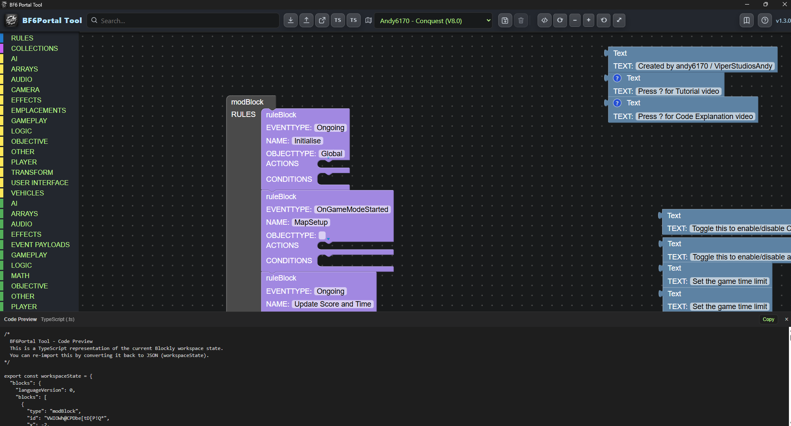

# BF6Portal Tool


Release notes: see `docs/RELEASE_NOTES_1.3.0.md`.
Changelog: see `CHANGELOG.md`.

**BF6Portal Tool** is a standalone visual logic editor for **Battlefield 6 Portal**, built with **Electron** + **Google Blockly**. It aims to replicate the Portal Rules Editor workflow in a desktop app, with offline editing and quality-of-life tooling.

## Screenshot



## What the UI provides

- **Workspace editor (Blockly):** build rule logic visually.
- **Toolbox search (header):** quickly filter blocks by name.
- **Workspace controls (header):** zoom in/out, reset zoom, zoom-to-fit, and trash/delete selected block.
- **Presets (header dropdown):**
    - 3 built-in presets (locked)
    - save your own presets, overwrite safely, delete user presets
- **Import / Export:**
    - load `.json` (Blockly workspace JSON) and legacy `.xml`
    - export Portal JSON (best-effort compatibility wrapper)
    - TypeScript snapshot export + TypeScript import (round-trip the workspace state)
- **Variables:** a dedicated VARIABLES toolbox category with:
    - “New / Manage Variables”
    - pre-filled GET/SET templates for existing variables
- **Collections / Bookmarks:** convert a selected stack into an offscreen definition and keep a compact call/bookmark block.
- **Navigation (“teleport”):** right-click jump helpers (MOD / owning rule / stack root / variables / subroutine call ⇄ definition).
- **Help:** Help modal + right-click per-block help using the local `bf6portal_blocks.json` docs.
- **Code Preview drawer:** resizable bottom drawer that shows a TypeScript representation of the current workspace state.

## Installation & setup

### Prerequisites

- Node.js (v18+ recommended)
- Python 3.8+ (only needed for some helper scripts)

### Getting started

1) Clone:

```bash
git clone https://github.com/neuro-1977/BF6Portal-Tool.git
cd BF6Portal-Tool
```

Alternate mirror (GitLab):

```bash
git clone https://gitlab.com/Neuro1977/bf6-portal-tool.git
cd BF6Portal-Tool
```

1) Install dependencies:

```bash
npm install
cd web_ui
npm install
cd ..
```

1) Run the app:

```bash
npm start
```

## Development

The project has two main parts:

1) Electron main process: `electron-main.js`
2) Renderer (Blockly editor): `web_ui/` (TypeScript + webpack)

### Rebuild the renderer

```bash
cd web_ui
npm run build
```

### Build a Windows installer

```bash
npm run dist
```

The installer output is written to `dist/`.

## Helper scripts

Utilities live in `tools/` (used to generate/inspect blocks/toolboxes from Portal data).

## Credits

- Block help/tooltips and Portal data are derived from **Portal Docs** by the Battlefield Portal Community:
    - [battlefield-portal-community/portal-docs](https://github.com/battlefield-portal-community/portal-docs)

## License

ISC
