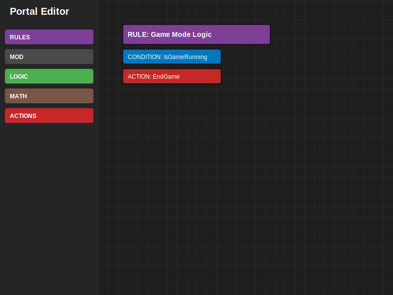

# BF6 Portal-Tool



Visual block editor for building Battlefield Portal scripts with drag-and-drop functionality, block chaining, and code export.

## Quick Start

**PowerShell:**

```powershell
# Create and activate a virtualenv
python -m venv .venv
.\.venv\Scripts\Activate.ps1

# Install requirements
pip install -r requirements.txt

# Run the editor
python .\source\Block_Editor.py
```

**Note:** `tkinter` is part of the Python standard library (Windows users: install the official CPython build).

## Features

- **Visual Block Editor**: Drag and drop programming blocks onto a scalable canvas
- **Battlefield Portal Style**: Blocks mimic the visual style of the official Battlefield Portal editor (Horizontal chains for Actions/Conditions)
- **Smart Snapping**: Blocks automatically snap together when brought close to valid connection points
- **Strict Hierarchy**: Enforces correct logical structure (MOD → RULES → CONDITIONS/ACTIONS)
- **Dynamic Resizing**: Container blocks (MOD, RULES) automatically expand to fit their contents
- **Contextual Help System**: Right-click any block for usage instructions and visual examples
- **Bidirectional Code Sync**: Edit code to generate blocks, or edit blocks to generate code
- **Zoom Controls**: Scale the workspace from 25% to 300% (Ctrl+Mouse Wheel, Ctrl+/-/0)
- **Grid System**: Visual grid that scales with zoom for precise block placement
- **Code Output**: Live editable code preview pane with bidirectional sync
- **Import/Export**: Save and load workspaces as JSON files

## Codebase Architecture

The project is organized into modular components for maintainability:

- **`source/`**: Core application code
  - **`Block_Editor.py`**: Main application entry point and controller.
  - **`Block_Renderer.py`**: Handles all visual drawing on the canvas (blocks, grid, connections).
  - **`Input_Handler.py`**: Manages user input (mouse clicks, drags, keyboard shortcuts).
  - **`Sidebar_Manager.py`**: Manages the left sidebar (categories, search, block spawning).
  - **`TopBar_Manager.py`**: Manages the top toolbar (Import/Export, Analyze) and zoom controls.
  - **`Block_Mover.py`**: Handles block movement and snapping logic.
  - **`Block_Data_Manager.py`**: Loads and manages block definitions from JSON assets.
  - **`Code_Generator.py`**: Generates text code from the visual block structure.
  - **`workspace_loader.py`**: Handles loading saved workspaces from JSON.
- **`assets/`**: JSON data files defining block behavior and appearance.
- **`docs/`**: Documentation and reference materials.
- **`tools/`**: Helper scripts for cataloging and maintenance.

## Usage

### Creating Blocks
1. Click category buttons (MOD, RULES, CONDITIONS, ACTIONS, EVENTS) in the sidebar
2. **Single-click** a menu item to spawn a block at the center of the view

### Moving Blocks
- **Click and drag** any block to move it
- Parent blocks automatically move their snapped children (chains move together)
- Hold **Shift** while dragging to detach a block from its parent

### Snapping Blocks Together
- Drag a block near a compatible connection point to snap it
- **Hierarchy Rules:**
  - **MOD**: The root container. Contains RULES.
  - **RULES**: Snaps inside MOD. Contains CONDITIONS and ACTIONS.
  - **CONDITIONS**: Snaps inside RULES (top slot). Connects horizontally.
  - **ACTIONS**: Snaps inside RULES (bottom slot). Connects horizontally.
  - **EVENTS**: Snaps inside CONDITIONS or ACTIONS.
- Blocks will visually "snap" into place when released near a valid target.
- **Horizontal Snapping**: Actions and Conditions now snap side-by-side (left-to-right) like puzzle pieces, matching the BF Portal interface.

### Zoom Controls
- **Ctrl + Mouse Wheel**: Zoom in/out
- **Ctrl + Plus/Minus**: Zoom in/out
- **Ctrl + 0**: Reset zoom to 100%

### Code Output

- View generated code in the right pane
- **Edit code directly** in the code pane
- Click **"⬅ Update Blocks"** to parse edited code and regenerate blocks on canvas
- Click **"🔄 Refresh Code"** to regenerate code from current blocks

### Help System

- **Right-click any block** to open the context menu
- Select **"Help & Examples"** to see usage instructions and examples
- Help content is extensible via JSON files in `assets/`

## Extending the Editor

You can add new block definitions as JSON files in the `assets/` folder:

- `assets/mod_data.json` — MOD (mod settings) blocks
- `assets/rules_data.json` — Rule header blocks
- `assets/events/event_data.json` — Event (start) blocks
- `assets/conditions/condition_data.json` — Condition blocks
- `assets/actions/action_data.json` — Action and control blocks

### JSON Structure

Each JSON file follows this structure:

```json
{
	"color": "#ff9800",
	"sub_categories": {
		"Category Name": {
			"BLOCK_ID": {
				"label": "Block Display Name",
				"type": "SEQUENCE",
				"args": ["arg1", "arg2"]
			}
		}
	}
}
```

**Block Types:**
- `SEQUENCE`: Regular action block with bottom notch for chaining
- `START`: Starting block (e.g., MOD, RULE)
- `CONDITION`: Conditional block (boolean expressions)
- `C_WRAP`: Control wrapper block (e.g., IF, WHILE)

After adding or editing JSON files, restart the editor to load changes.

## Project Structure

```
source/
  Block_Editor.py         # Main UI and canvas management
  Block_Mover.py          # Block spawning and snapping logic
  Block_Data_Manager.py   # Block data loading and management
  io_handlers.py          # Import/export dialogs
  workspace_loader.py     # JSON workspace loading
  editor_helpers.py       # Utility functions
assets/
  mod_data.json           # MOD block definitions
  rules_data.json         # RULE block definitions
  actions/                # Action block definitions
  conditions/             # Condition block definitions
  events/                 # Event block definitions
```

## Notes

- Top toolbar uses colored panels instead of image icons
- Grid snapping is always enabled for precise block alignment
- Canvas workspace is 5000x5000 pixels (expands dynamically with content)
- Blocks and workspace state can be saved/loaded as JSON files

Files added by this scaffolding:
- `pyproject.toml` - project metadata
- `requirements.txt` - runtime deps
- `.gitignore` - common ignores
- `run_editor.ps1` - convenience PowerShell runner
- `.vscode/launch.json` - VS Code run configuration

Next steps:
- Run the PowerShell commands above to set up the environment.
- Tell me if you want a package layout (installable) or CI config added.
