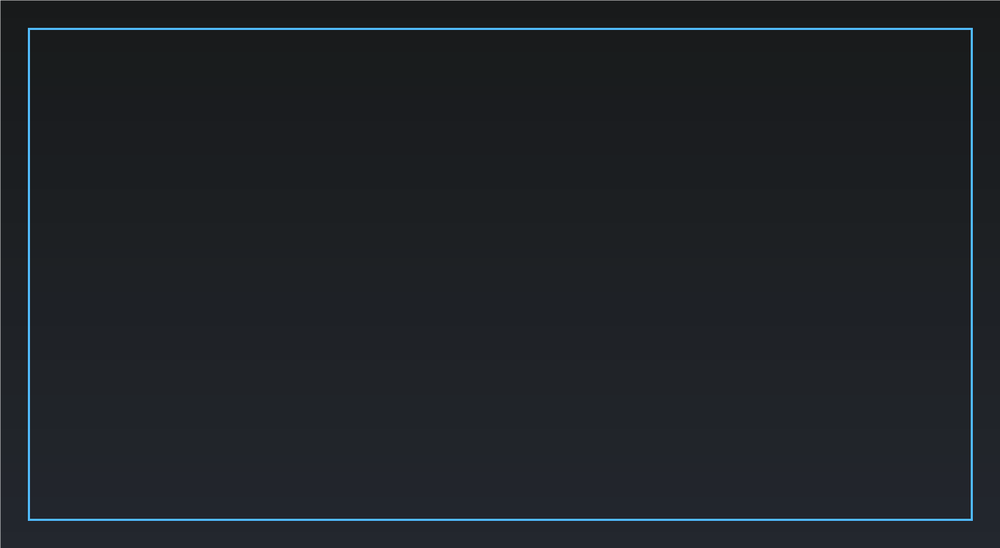

# Release Notes - v1.2.9

## Screenshot

## Highlights

- **Collections / Bookmarks (MVP):** convert a stack into an offscreen collection definition and leave a call/bookmark block in place.
- **Right-click teleport / navigation:** faster movement around large workspaces (MOD, Rules, Subroutines, stack root, etc.).
- **Portal JSON compatibility:** exports in Portal wrapper format (`{ "mod": { "blocks": ... } }`) and imports accept multiple common shapes.

## Features & Improvements

- **Collections toolbox improved:** the **COLLECTIONS** category now dynamically lists existing collections and includes a **Convert selection to collection** action.
- **Collections visuals:** collection call/definition blocks are taller (easier to spot; less “lost in the soup”).
- **Header/UI polish:**
  - brand/logo aligned on the left
  - toolbox search moved into the header
  - version label shown top-right
  - Code Preview opened via a normal header button
- **Variables toolbox restored:** VARIABLES category provides a **New / Manage Variables** button and lists existing variables as pre-filled GET/SET blocks.

## Fixes

- **Selection Lists dataset:** regenerated `selection-lists.md` so `widget 1` uses the base enum name (no `Item` suffix).
- **Selection Lists dropdown robustness:** case-insensitive lookups + alias mapping for enum naming mismatches.
- **UI clutter:** removed the unused Live Diagnostics overlay and floating Code Preview toggle.

## Credits

- Portal data and block help/tooltips are derived from **Portal Docs** by the Battlefield Portal Community:
  - https://github.com/battlefield-portal-community/portal-docs

## Known Issues

- A persistent vertical scrollbar may still appear next to the toolbox flyout in certain states. This is tracked for a future fix.
